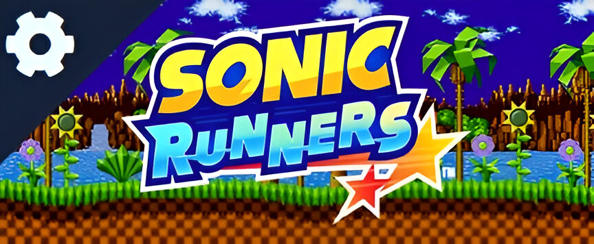

<h1>Sonic-Runners 🌀</h1>
  
  A simple game where you control Sonic and his friends through an infinite stage, is a fan-project created using HTML, CSS and JS, based on the 
  Dino Game from Chrome. <br><br>
 
  This project was created with love for the Sonic franchise, with no intended monetary values.<br>
  I hope I can still update the project with time, adding new playble characters, new stages, even new mechanics!<br>
 
 <h2> 🟦 How to Play 🟦 </h2>
 Press any key in your keyboard or click the screen to jump! <br>
 Pay attention to enemies position to be sure that you're safe and focus on surpassing your highscore!<br><br>
 You can make changes to the game in the Settings menu!<br>
 
 <h2> ⚙️ Settings ⚙️ </h2>
 You can acess Settings by pressing the triangle at the top left of the site!<br><br>
 
 
 Inside settings you can change musics for Menu, Game and Game Over! And even mute the music/soundeffects if wanted.<br>
 Furthermore, you can make changes to the game! Like disabling the bakcground objects and lowering the background speed!<br>
 
 If you're playing on mobile, you can change the screen orientation for a better view! (But it will make the obstacles faster too!)<br>
 
 <h2> 💠 Tips 💠 </h2>
 
```diff
  # You can Double Jump if you press jump 2 times!
  # Better not change tab after the game started... You'll lose a life!
```
```diff
  # The Double Jump mechanic gives you some invincibility time, so use it when needed!
  # Alongside this, the Double Jump let you vulnerable for a short time when used, so be careful!
```
```diff
  # You can change the Menu/Game/Game Over music in the settings!
  # You can change your character in the 'Select a Character' menu!
```
```diff
  # You can't make any changes after starting a game, so be sure when to start!
  # On the PC, you can start without having to press the button, just by pressing a key! Both to Start and Restart...
```
<h2> 🌐 Conclusion 🌐 </h2>
I learned a lot developting this project, and had a lot of fun! :) <br>
This project was more like a love letter to the Sonic franchise! So I hope everyone seeing this have fun playing!<br>

<h3>🔷 Take a look at the website here: <a href="https://plopesk.github.io/Sonic-R/"> Sonic Runner </a> 🔷</h3>
<h3>🌐 See more of the production here: <a href="https://plopesk.github.io/Sonic-R/about.html"> About Page </a> 🌐</h3>
 
